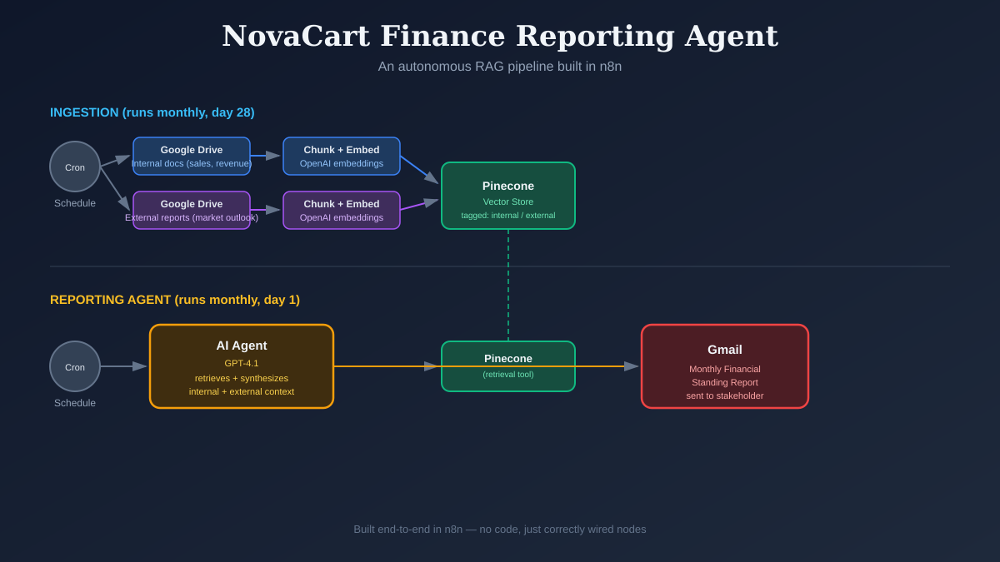

# I Built an AI Agent That Writes NovaCart's Monthly Finance Report — Without Me Touching a Spreadsheet

### How a Retrieval-Augmented Generation pipeline in n8n turned a manual, error-prone finance ritual into a self-running system

---

## The Problem: A Monthly Ritual Nobody Enjoyed

At NovaCart (a fictional e-commerce company I used for this build), the Product Finance team faces a familiar grind at the start of every month: pull internal sales and revenue numbers from scattered spreadsheets and reports, cross-reference them against external market intelligence — industry outlooks, consumer trend reports — and stitch it all into a coherent narrative for leadership.

It's the kind of work that's important but repetitive: manual data aggregation, manual cross-referencing, and a real risk of oversight when it's done under deadline pressure every single month.

The brief was simple to state and genuinely hard to build: create an AI agent that autonomously queries internal product performance data, analyzes external market trends, synthesizes the two into a structured report, and emails it to stakeholders — automatically, by the 1st of every month.

## The Approach: RAG, Not Just a Chatbot

The obvious naive solution is "just ask ChatGPT to write the report." The problem is that a general-purpose model has no idea what NovaCart's actual Q3 revenue was, or what a specific McKinsey outlook said last week. It would hallucinate numbers with total confidence.

So instead I built a **Retrieval-Augmented Generation (RAG)** pipeline: a system that first retrieves the *actual* relevant documents from a vector database, then hands them to an LLM to synthesize — grounding every claim in real source material instead of the model's imagination.

I built the whole thing in **n8n**, a visual workflow automation tool, which turned out to be a genuinely good fit: every stage of a RAG pipeline (fetch → chunk → embed → store → retrieve → generate → deliver) maps cleanly onto a node graph you can actually see and debug.

## Architecture: Two Workflows, One Pipeline

**1. Ingestion Workflow** — runs monthly, a few days before month-end.

Two parallel branches pull from Google Drive:
- **Internal branch**: company annual reports, product catalogs, and weekly SKU sales/revenue data
- **External branch**: industry outlook and consumer-trend PDFs (semiconductor industry reports, McKinsey technology trend reports, and similar)

Each document gets chunked, embedded via OpenAI's embedding model, tagged with metadata (`source: internal` or `source: external`), and upserted into a shared **Pinecone** vector index.

**2. Reporting Agent Workflow** — runs monthly, on the 1st.

A scheduled trigger kicks off an **AI Agent** node (GPT-4.1) equipped with the Pinecone index as a *retrieval tool*. The agent decides for itself what to search for — typically querying internal performance data and external market context separately — then synthesizes both into a structured report: Executive Summary, Internal Performance Highlights, External Market Context, Correlated Insights, and Recommendations. The output is handed to a Gmail node, which emails it directly to the stakeholder.

No human touches the pipeline in between. It just runs.

## What Actually Broke (and What I Learned Fixing It)

The theory is clean; the build taught me more than the theory did.

**Wiring a vector store isn't the same as wiring a database.** My first instinct was to connect the Pinecone node directly into the trigger, the way you'd wire any other node. That's wrong — a vector store used by an agent needs to run in a distinct "Retrieve as Tool" mode and plug into the *Agent's tool input*, not the main data flow. It's a subtly different mental model: the agent calls the tool when it decides to, not on a fixed schedule.

**Embedding dimensions are a silent failure mode.** If the embedding model or vector dimensions used at ingestion time don't *exactly* match what's used at retrieval time, Pinecone doesn't necessarily throw a loud error — it can just return wrong or empty results. I had to explicitly verify `text-embedding-3-small` at 1024 dimensions matched on both the ingestion side and the retrieval side.

**The scariest bug was the quietest one.** After wiring everything correctly, the agent ran, called the retrieval tool twice, and returned nothing — it politely told me it "was unable to retrieve internal or external data." No error, no crash. The root cause: a **Pinecone namespace mismatch**. My ingestion nodes and my retrieval node were writing to and reading from different namespaces within the same index — logically separate buckets that never overlapped. Once aligned, the very next run pulled 40 relevant chunks and produced a genuinely synthesized report, citing real revenue figures alongside real external market commentary.

**Timing matters in automation, not just correctness.** Even after the pipeline worked, I'd set both the ingestion and the reporting agent to trigger at the exact same moment on the same day — a race condition waiting to happen, where the agent could query stale or half-updated data. Staggering ingestion a few days before the reporting run fixed that.

## The Result

A fully automated pipeline that, once a month:

1. Refreshes its knowledge base from both internal and external sources
2. Autonomously decides what to retrieve and how to structure the analysis
3. Writes a leadership-ready report grounded in real data — not guesses
4. Delivers it straight to an inbox, formatted in clean HTML

No spreadsheet wrangling. No cross-referencing PDFs by hand. Just a report waiting in the inbox on the 1st.

## Takeaways for Anyone Building Something Similar

- **RAG is really a plumbing problem more than an AI problem.** The LLM synthesis step was the *easy* part. Getting chunking, embedding consistency, metadata tagging, and namespace management right was where all the real work lived.
- **Tag your data at ingestion time.** Metadata like `source: internal` vs `source: external` cost nothing to add up front and made both debugging and prompt design far easier later.
- **Silent empty results are more dangerous than errors.** A vector store that returns nothing looks, on the surface, like it's "working" — the workflow runs green, no exceptions thrown. Always sanity-check that retrieval is actually returning content, not just that the node executed.
- **No-code doesn't mean no debugging.** Building this in n8n didn't remove the need to understand embeddings, vector dimensions, or race conditions — it just meant debugging them visually instead of in a stack trace.

If you're a PM, TPM, or anyone adjacent to AI product work without a deep ML background, this is a genuinely approachable way to get hands-on with what "agentic AI" actually means in practice — not a magic black box, but a graph of well-understood pieces that each need to be correctly connected.

---

*Built as part of an applied agentic AI learning exercise, using n8n, OpenAI embeddings/GPT-4.1, Pinecone, and Gmail.*
